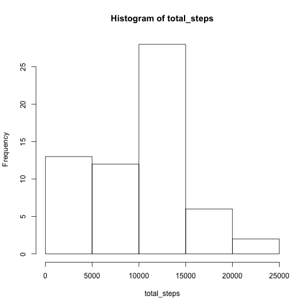
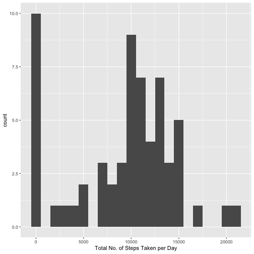
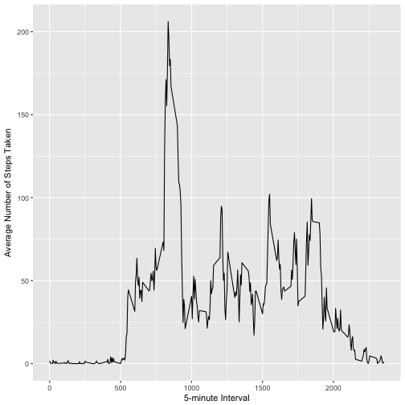
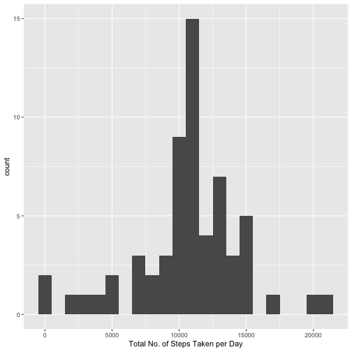
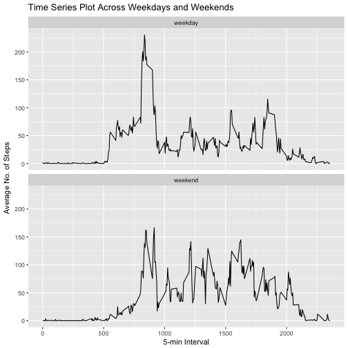

Introduction
===
It is now possible to collect a large amount of data about personal movement using activity monitoring devices such as a Fitbit, Nike Fuelband, or Jawbone Up. These type of devices are part of the “quantified self” movement – a group of enthusiasts who take measurements about themselves regularly to improve their health, to find patterns in their behavior, or because they are tech geeks. But these data remain under-utilized both because the raw data are hard to obtain and there is a lack of statistical methods and software for processing and interpreting the data.

This assignment makes use of data from a personal activity monitoring device. This device collects data at 5 minute intervals through out the day. The data consists of two months of data from an anonymous individual collected during the months of October and November, 2012 and include the number of steps taken in 5 minute intervals each day.

The data for this assignment can be downloaded from the course web site:

- Dataset: Activity monitoring data https://d396qusza40orc.cloudfront.net/repdata%2Fdata%2Factivity.zip

The variables included in this dataset are:

- steps: Number of steps taking in a 5-minute interval (missing values are coded as NA)

- date: The date on which the measurement was taken in YYYY-MM-DD format

- interval: Identifier for the 5-minute interval in which measurement was taken

The dataset is stored in a comma-separated-value (CSV) file and there are a total of 17,568 observations in this dataset.

# Loading and preprocessing the data

1) Load the data (i.e. read.csv())

Download and unzip file into designated folder:

```r
fileUrl <- "https://d396qusza40orc.cloudfront.net/repdata%2Fdata%2Factivity.zip"
download.file(fileUrl, "Activity monitoring data.zip")
unzip("Activity monitoring data.zip", exdir = "Activity monitoring data")
```

2) Process/transform the data (if necessary) into a format suitable for your analysis
 

```r
activity <- read.csv("~/Desktop/R Files/Activity monitoring data/activity.csv")
head(activity)
```

```
##   steps       date interval
## 1    NA 2012-10-01        0
## 2    NA 2012-10-01        5
## 3    NA 2012-10-01       10
## 4    NA 2012-10-01       15
## 5    NA 2012-10-01       20
## 6    NA 2012-10-01       25
```

# What is mean total number of steps taken per day?
#### Ignore the missing values in the dataset.

1) Calculate the total number of steps taken per day


```r
total_steps <- tapply(activity$steps, activity$date, sum, na.rm = TRUE)
head(data.frame(total_steps))
```

```
##            total_steps
## 2012-10-01           0
## 2012-10-02         126
## 2012-10-03       11352
## 2012-10-04       12116
## 2012-10-05       13294
## 2012-10-06       15420
```

```r
summary(total_steps)
```

```
##    Min. 1st Qu.  Median    Mean 3rd Qu.    Max. 
##       0    6778   10395    9354   12811   21194
```

2) If you do not understand the difference between a histogram and a barplot, research the difference between them. Make a histogram of the total number of steps taken each day


```r
hist(total_steps)
```



Or alternatively, with below plot


```r
library(ggplot2)
qplot(total_steps, binwidth = 1000, xlab = "Total No. of Steps Taken per Day")
```



3) Calculate and report the mean and median of the total number of steps taken per day


```r
mean(total_steps)
```

```
## [1] 9354.23
```

```r
median(total_steps)
```

```
## [1] 10395
```

# What is the average daily activity pattern?

1) Make a time series plot (i.e. type = "l") of the 5-minute interval (x-axis) and the average number of steps taken, averaged across all days (y-axis)


```r
library(ggplot2)

average_steps_per_interval <- aggregate(x = list(averageSteps = activity$steps), by = list(interval = activity$interval), mean, na.rm = TRUE)

ggplot(data = average_steps_per_interval, aes(x = interval, y = averageSteps)) +
    geom_line() +
    xlab("5-minute Interval") +
    ylab("Average Number of Steps Taken") 
```



2) Which 5-minute interval, on average across all the days in the dataset, contains the maximum number of steps?


```r
# Find row with max of steps
max_steps_row <- which.max(average_steps_per_interval$averageSteps)

# Find interval with this max
average_steps_per_interval[max_steps_row, ]
```

```
##     interval averageSteps
## 104      835     206.1698
```

        The interval 835 has the maximum average value of steps (206.1698).

# Imputing missing values
#### Note that there are a number of days/intervals where there are missing values (coded as NA). The presence of missing days may introduce bias into some calculations or summaries of the data.

1) Calculate and report the total number of missing values in the dataset (i.e. the total number of rows with NAs)


```r
sum(is.na(activity$steps))
```

```
## [1] 2304
```

        Total number of rows with NA’s is 2304.

2) Devise a strategy for filling in all of the missing values in the dataset. The strategy does not need to be sophisticated. For example, you could use the mean/median for that day, or the mean for that 5-minute interval, etc.

        I will fill the NA with average value for that 5-min interval

3) Create a new dataset that is equal to the original dataset but with the missing data filled in.


```r
fill_value <- function(steps, interval) {
    filled <- NA
    if (!is.na(steps)) 
            filled <- c(steps) 
    else filled <- (average_steps_per_interval[average_steps_per_interval$interval == interval, "averageSteps"])
    return(filled)
}
filled_activity <- activity
filled_activity$steps <- mapply(fill_value, filled_activity$steps, filled_activity$interval)

# Check there is indeed no more NA values
head(filled_activity)
```

```
##       steps       date interval
## 1 1.7169811 2012-10-01        0
## 2 0.3396226 2012-10-01        5
## 3 0.1320755 2012-10-01       10
## 4 0.1509434 2012-10-01       15
## 5 0.0754717 2012-10-01       20
## 6 2.0943396 2012-10-01       25
```

4)

- Make a histogram of the total number of steps taken each day.


```r
total_steps <- tapply(filled_activity$steps, filled_activity$date, sum)
qplot(total_steps, binwidth = 1000, xlab = "Total No. of Steps Taken per Day")
```



Notice a significant shift of frequency from value 0 (since we excluded/ignored NA values in the earlier case, these are then taken to be value 0), to value 10766 (since we have now replaced the NA values with average value for that 5-min interval).

- Calculate and report the mean and median total number of steps taken per day. 


```r
mean(total_steps)
```

```
## [1] 10766.19
```

```r
median(total_steps)
```

```
## [1] 10766.19
```

- Do these values differ from the estimates from the first part of the assignment? 

        Yes. There is an increase in mean and median.  

- What is the impact of imputing missing data on the estimates of the total daily number of steps?

        After inputting the missing data by filling the NA values with average value for that 5-min interval, 
        - There is an increase in the mean of total daily number of steps
        - There is an increase in the median of total daily number of steps
        - There is a decreased difference between the mean and median of total daily number of steps

# Are there differences in activity patterns between weekdays and weekends?

#### For this part the weekdays() function may be of some help here. Use the dataset with the filled-in missing values for this part.

1) Create a new factor variable in the dataset with two levels – “weekday” and “weekend” indicating whether a given date is a weekday or weekend day.


```r
filled_activity['type_of_day'] <- weekdays(as.Date(filled_activity$date))
filled_activity$type_of_day[filled_activity$type_of_day  %in% c('Saturday','Sunday') ] <- "weekend"
filled_activity$type_of_day[filled_activity$type_of_day != "weekend"] <- "weekday"
```


2) Make a panel plot containing a time series plot (i.e. type="l") of the 5-minute interval (x-axis) and the average number of steps taken, averaged across all weekday days or weekend days (y-axis). See the README file in the GitHub repository to see an example of what this plot should look like using simulated data.


```r
# Convert type_of_day from character to factor
filled_activity$type_of_day <- as.factor(filled_activity$type_of_day)

# Calculate average steps by interval across all days
df_imputed_steps_by_interval <- aggregate(steps ~ interval + type_of_day, filled_activity, mean)

# Create a plot
qplot(interval, steps, 
      data = df_imputed_steps_by_interval, 
      type = 'l', 
      geom=c("line"),
      xlab = "5-min Interval", 
      ylab = "Average No. of Steps", 
      main = "Time Series Plot Across Weekdays and Weekends ") + facet_wrap(~ type_of_day, ncol = 1)
```

```
## Warning: Ignoring unknown parameters: type
```




library(knitr)  
setwd(<working directory>) 
knit2html(“document.Rmd”) 
browseURL(“document.html”) 
